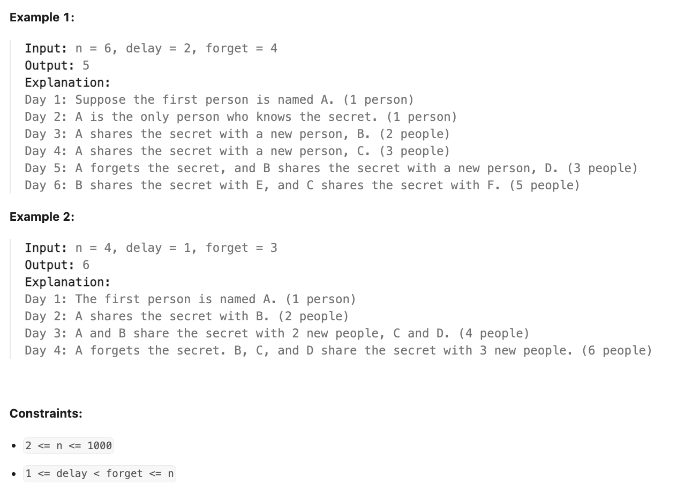

**LeetCode [2327]. [Number of People Aware of a Secret]**

**Category:** [**DP/Queue/Simulation**]
**Difficulty:** [Medium]

------

**Problem Summary:**

On day `1`, one person discovers a secret.

You are given an integer `delay`, which means that each person will **share** the secret with a new person **every day**, starting from `delay` days after discovering the secret. You are also given an integer `forget`, which means that each person will **forget** the secret `forget` days after discovering it. A person **cannot** share the secret on the same day they forgot it, or on any day afterwards.

Given an integer `n`, return *the number of people who know the secret at the end of day* `n`. Since the answer may be very large, return it **modulo** `10^9 + 7`.

**Example:**


 

------

**Intuition:**

1. The key insight is to track **when people learn the secret** and use a **sliding window** approach:
   - **dp[i]** = number of people who learned the secret on day i
   - **currentAdd** = number of people who can currently share the secret (learned it ≥ delay days ago, but < forget days ago)
   - For each day, we:
     1. Add people who can now share (completed delay period)
     2. Remove people who forgot (exceeded forget period)
     3. Calculate new people learning the secret = currentAdd
   - Finally, sum up people who learned in the last `forget` days (they still remember)

------

**Approach:** pseudocode

```pseudocode
FUNCTION peopleAwareOfSecret(n, delay, forget):
    MOD = 1000000007
    dp = array of size (n+1) initialized to 0
    dp[1] = 1  // One person knows secret on day 1
    
    currentAdd = 0  // Number of people who can share secret today
    
    FOR day i FROM (delay+1) TO n:
        // Add people who just became able to share (after delay period)
        currentAdd = (currentAdd + dp[i-delay]) % MOD
        
        // Remove people who forgot the secret
        forgetDay = i - forget
        IF forgetDay > 0:
            currentAdd = (currentAdd - dp[forgetDay] + MOD) % MOD
        
        // New people learning secret today
        dp[i] = currentAdd
    END FOR
    
    // Count all people who still remember (haven't forgotten yet)
    result = 0
    FOR day i FROM (n-forget+1) TO n:
        result = (result + dp[i]) % MOD
    END FOR
    
    RETURN result
```


------

**Complexity:**

- Time: O(n) : 
  - iterate through time 1 to n
- Space: O(n)
  - use a size n vector: `dp` 

------

**Reflection / Notes:**

* At the first glance, I want to keep track of each person (record the time for each of them, and update the record for each of them for every iteration), however the complexity is exponential and will grow too big if n is large.
* It is pretty hard to come up with the idea of recording the number of people who know the secret in the exact time `t`. Moreover, it is also hard to recognize this problem as a dynamic programming problem.
