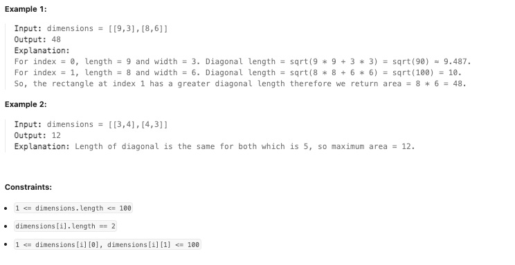

**LeetCode [3000]. [Maximum Area of Longest Diagonal Rectangle]**

**Category:** [**Array**]
**Difficulty:** [Easy]

------

**Problem Summary:**

You are given a 2D **0-indexed** integer array `dimensions`.

For all indices `i`, `0 <= i < dimensions.length`, `dimensions[i][0]` represents the length and `dimensions[i][1]` represents the width of the rectangle `i`.

Return *the **area** of the rectangle having the **longest** diagonal. If there are multiple rectangles with the longest diagonal, return the area of the rectangle having the **maximum** area.*

**Example:**
 


------

**Intuition:**

1. Just record the area of the rectangle which has the longest diagonal length so far by iteration.
2. If we find another rectangle which has the same length of the current one, record the one with bigger area.

------

**Approach:** pseudocode

```pseudocode
length_square = 0, area = 0
for d in dimensions:
	l = d[0], w = d[1]
	if length_square is less than l*l+w*w, set length_square to l*l+w*w, area to l*w
	if length_square is equal to l*l+w*w set area to l*w if area is smaller, otherwise remains unchanged

return area
			
```


------

**Complexity:**

- Time: O( $\lvert$ dimensions $\rvert$ ) : 
  - simply iterate through all elements in the vector: dimensions.
- Space: O(1)
  - only use two integer variables to record data, so it is constant space. &rarr; O(1) 

------

**Reflection / Notes:**

* Although this is a fairly easy question, it is still helpful to look at others code and see how I can learn from them.
