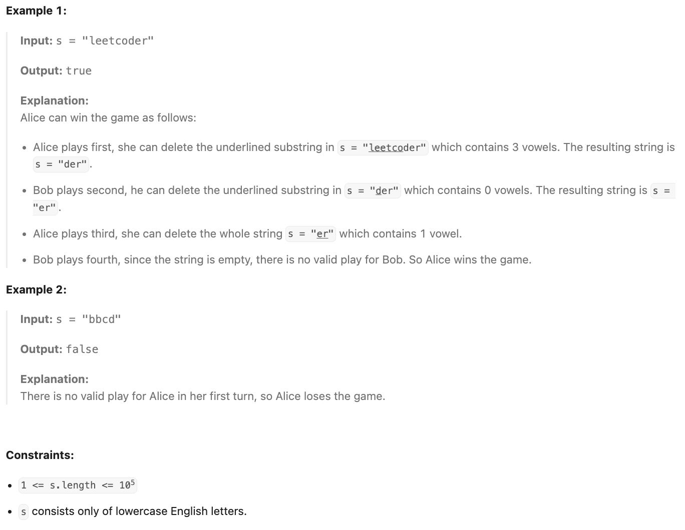

**LeetCode [3227]. [Vowels Game in a String]**

**Category:** [**Math/String/Brainteaser/Game Theory**]
**Difficulty:** [Medium]

------

**Problem Summary:**

Alice and Bob are playing a game on a string.

You are given a string `s`, Alice and Bob will take turns playing the following game where Alice starts **first**:

- On Alice's turn, she has to remove any **non-empty** substring from `s` that contains an **odd** number of vowels.
- On Bob's turn, he has to remove any **non-empty** substring from `s` that contains an **even** number of vowels.

The first player who cannot make a move on their turn loses the game. We assume that both Alice and Bob play **optimally**.

Return `true` if Alice wins the game, and `false` otherwise.

The English vowels are: `a`, `e`, `i`, `o`, and `u`.

**Example:**



 

------

**Intuition:**

1. If there is no vowel in the string, Alice lose.
2. If there is at least one vowel in the string, Alice will always be able to make sure Bob has no chance to win.

------

**Approach:** pseudocode

```pseudocode
FUNCTION doesAliceWin(string s):
    FOR each character c in s:
        IF c is in {'a', 'e', 'i', 'o', 'u'}:
            RETURN true
        END IF
    END FOR
    RETURN false
END FUNCTION
```


------

**Complexity:**

- Time: O(n) : 
  - the worst case is that no character in string `s` is a vowel.
- Space: O(1)
  - don't need to store any data

------

**Reflection / Notes:**

* It might seems hard for the first glance, but if we try through some simple cases we will notice the underlying logic.
