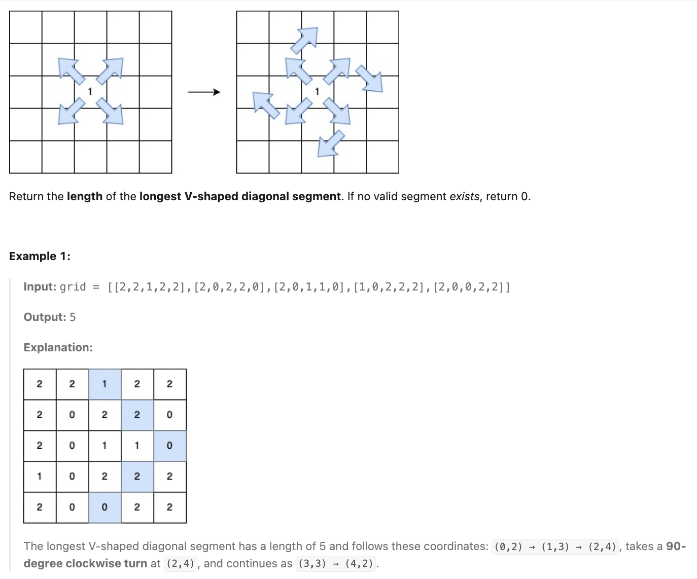
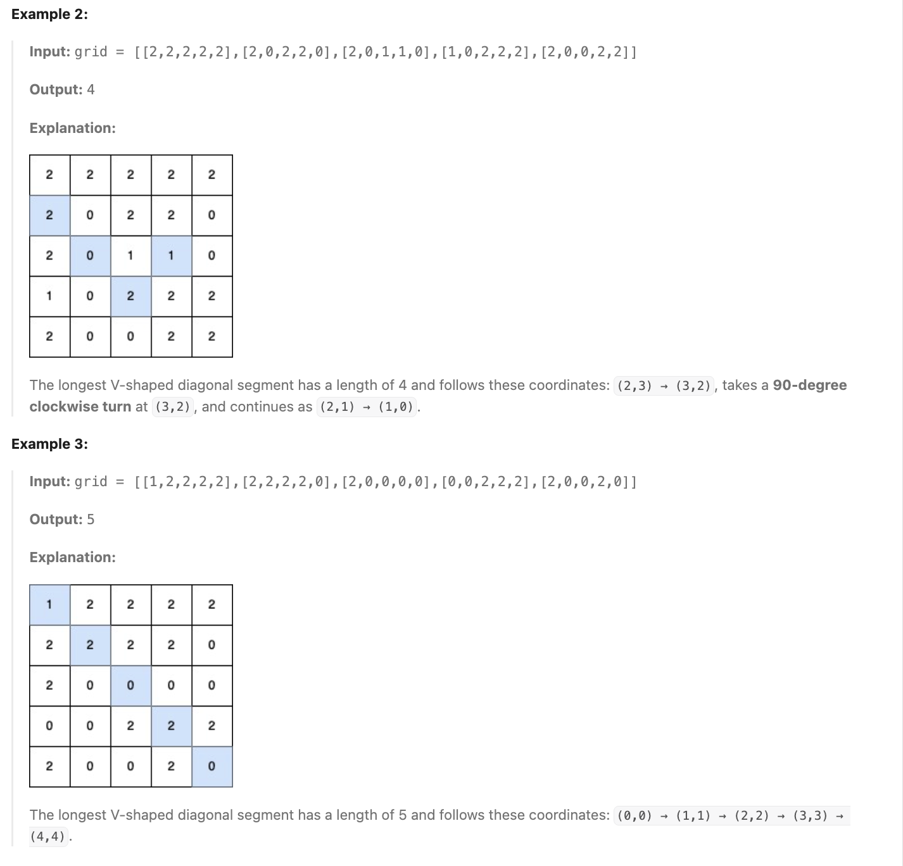
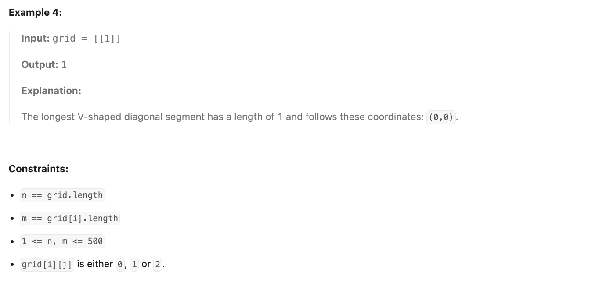

**LeetCode [3459]. [Length of Longest V-Shaped Diagonal Segment]**

**Category:** [**Array/DP/Memoization/Matrix**]
**Difficulty:** [Hard]

------

**Problem Summary:**

You are given a 2D integer matrix `grid` of size `n x m`, where each element is either `0`, `1`, or `2`.

A **V-shaped diagonal segment** is defined as:

- The segment starts with `1`.
- The subsequent elements follow this infinite sequence: `2, 0, 2, 0, ...`.
- The segment:
  - Starts **along** a diagonal direction (top-left to bottom-right, bottom-right to top-left, top-right to bottom-left, or bottom-left to top-right).
  - Continues the **sequence** in the same diagonal direction.
  - Makes **at most one clockwise 90-degree** **turn** to another diagonal direction while **maintaining** the sequence.


**Example:**


 




------

**Intuition:**

1. The problem asks for the longest zigzag-like diagonal path in a grid, where cells contain either `0`, `1` or `2`, and we can change direction at most once.

   - Each move is restricted to one of the four diagonal directions: &searr;, &swarr;, &nwarr;, &nearr;.
   - Starting from a `1` cell, we want to extend the path as far as possible while alternating between `2` and `0`.
   - The DFS is used to simulate walking along the diagonals:
     - Continue straight in the current direction if the next cell matches the required `target` value.
     - If we still have a turn left, we are also allowed to change direction (90° clockwise only in your code).
   - At each step, we return the longest valid alternating path length from that point.
   - For every starting `1`, we try all 4 directions and take the maximum.

   So the idea is basically: **from every `1`, explore all diagonals with DFS, alternating between 1 and 2, and allow at most one clockwise turn.**

------

**Approach:** pseudocode

```pseudocode
function dfs(grid, i, j, d, target, turn):
    # move one step in direction d
    i ← i + dir[d].row
    j ← j + dir[d].col

    # check boundaries
    if i is out of bounds OR j is out of bounds:
        return 0

    # cell must match target value
    if grid[i][j] != target:
        return 0

    # continue straight in same direction
    l1 ← dfs(grid, i, j, d, 2 - target, turn)

    # if no turns left, cannot change direction
    if turn == 0:
        return l1 + 1

    # try making a clockwise 90° turn
    new_d ← (d + 1) mod 4
    l2 ← dfs(grid, i, j, new_d, 2 - target, turn - 1)

    return max(l1, l2) + 1


function possibleAns(grid, i, j):
    # must start from a cell with value 1
    sol ← 1
    maxLength ← 0

    for d from 0 to 3:
        maxLength ← max(maxLength, dfs(grid, i, j, d, 2, 1))

    return sol + maxLength


function lenOfVDiagonal(grid):
    n ← number of rows
    m ← number of columns
    sol ← 0

    for i from 0 to n-1:
        for j from 0 to m-1:
            if grid[i][j] == 1:
                sol ← max(sol, possibleAns(grid, i, j))

    return sol


# directions (↘, ↙, ↖, ↗)
dir = [(1,1), (1,-1), (-1,-1), (-1,1)]

			
```


------

**Complexity:**

- Time: O(n\*m\*min(n,m) ) : 
  
  - Iterate over every cell &rarr; O(n\*m) 
  - For each cell that equals 1, I try 4 directions; and for each direction, we call `DFS` and costs at most O(min(n,m)) &rarr; longest diagonal path
  
  &rarr; The overall time complexity is O(n\*m)\*O(4\*min(n,m)) = O(n\*m\*min(n,m)) 
- Space: O(min(n,m))
  
  - I only use recursion stack only, and the recursion depth is at most O(min(n,m)) &rarr; diagonal length

------

**Reflection / Notes:**

* Try to divide the question into several smaller problems, it might help.
* For this kind of problem that have overlapping subproblems, it is better to use memoization; which can make the time complexity reduce to O(n\*m) 
