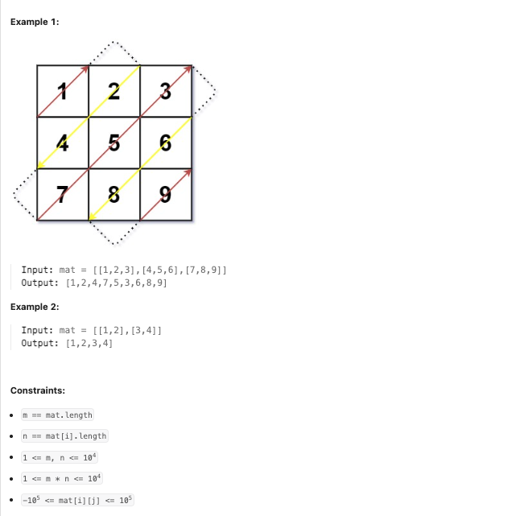

**LeetCode [498]. [Diagonal Traverse]**

**Category:** [**Array/Matrix/Simulation**]
**Difficulty:** [Medium]

------

**Problem Summary:**
Given an `m x n` matrix `mat`, return *an array of all the elements of the array in a diagonal order*.

**Example:**



------

**Intuition:**

1. Two Directions to consider: **up-right** & **down-left** 
   1. Going **up-right** (&nearr;), two boundary conditions to consider
      1. if we are at the **Rightmost Column**, **Go Down** (&darr;) 
      2. else if we are at the **Top Row**, **Go Right** (&rarr;) 
      3. Else (**Not** boundary), **Go up-right** (&nearr;) 
   2. Going **down-left** (&swarr;), two boundary conditions to consider
      1. if we are at the **Bottom Row**, **Go Right** (&rarr;) 
      2. else if we are at the **Leftmost Column**, **Go Down** (&darr;) 
      3. Else (**Not** boundary), **Go down-left** (&swarr;) 
2. Every diagonal can be uniquely identified by the **sum of its row and column indices (row + col)** 
   1. if (row+col) is **Even** &rarr; we move **up-right** 
   2. If (row+col) is **Odd** &rarr; we move **down-left** 

------

**Approach:** pseudocode

```pseudocode
start_row = 0, start_col = 0
row set to start_row, col set to start_col

while not iterates all entries of the given matrix:
	path.append(matrix[row][col])
	if (row+col) is Even: 
		if at the rightmost column
			row++
		else if at the top row
			col++
		else 
			row--; col++;
	else: (row+col) is Odd
		if at the bottom row
			col++
		else if at the leftmost column
			row++
		else
			row++; col--;
return path
			
```


------

**Complexity:**

- Time: O(n\*m) : 
  - Traverse the matrix will take O(n\*m)
  - Each iteration takes constant time &rarr; O(1)
- Space: O(n\*m)
  - the vector `path` takes n\*m values, each value takes O(1) space &rarr; Overall space: O(n\*m)

------

**Reflection / Notes:**

* It takes some time to notice that every diagonal can be uniquely identified by the **sum of its row and column indices (row + col)** &rarr; it might be a useful pattern when dealing with diagonals 

- It takes some time to deal with the boundary issue.